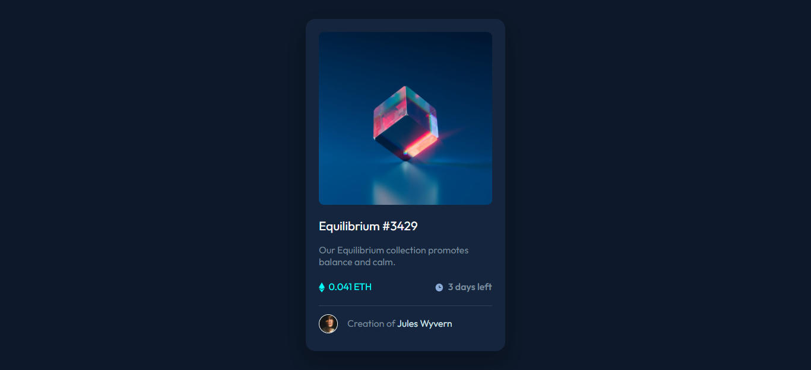
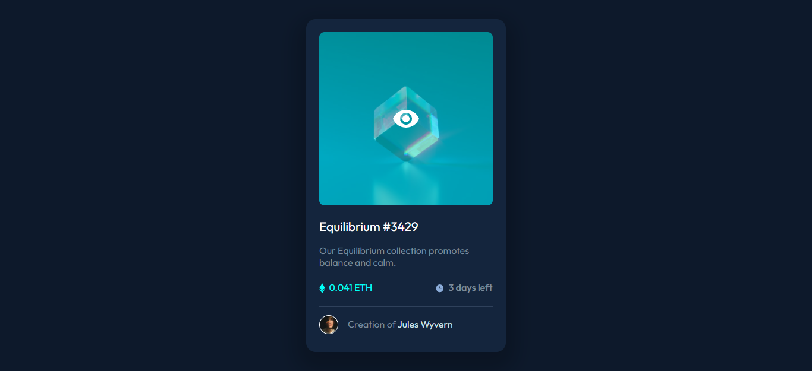
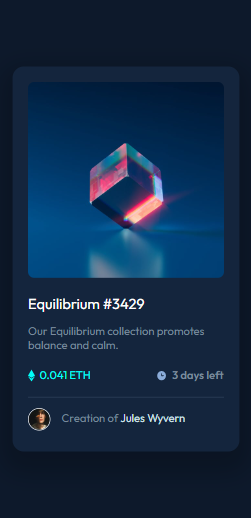

# Frontend Mentor - NFT preview card component solution

This is a solution to the [NFT preview card component challenge on Frontend Mentor](https://www.frontendmentor.io/challenges/nft-preview-card-component-SbdUL_w0U). Frontend Mentor challenges help you improve your coding skills by building realistic projects. 

## Table of contents

  - [The challenge](#the-challenge)
  - [Screenshot](#screenshot)
  - [Links](#links)
- [My process](#my-process)
  - [Built with](#built-with)
  - [What I learned](#what-i-learned)
  - [Continued development](#continued-development)
- [Author](#author)

### The challenge

Users should be able to:

- View the optimal layout depending on their device's screen size
- See hover states for interactive elements

### Screenshot

### Links

- Solution URL: (https://github.com/floatingPebble/floatingPebble.nft-preview-card-component/tree/main)

## My process

- Finished layout in HTML
- Added CSS global variables 
- Added max-width to card container for responsivnes
- Styled it in CSS from top parent all the way down to last child element

### Built with

- Semantic HTML5 markup
- CSS custom properties
- Flexbox
- Mobile-first workflow

### What I learned

Improved my card building skills and my overall CSS skills.

### Continued development

Random challenges from frontendmentor.io since I am trying to replicate real job workflow.

## Author

- Website - [Goran Malić](https://github.com/floatingPebble)
- Frontend Mentor - [@floatingPebble](https://www.frontendmentor.io/profile/floatingPebble)
- Twitter - [@ShyToadGames](https://twitter.com/ShyToadGames)
